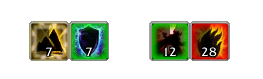
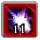
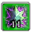
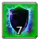
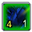
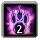
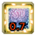
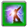
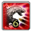
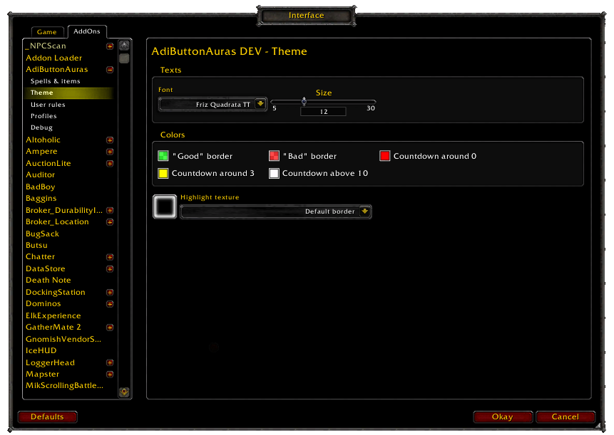

Introduction
============

AdiButtonAuras is an addon that allows you to track buffs and debuffs (also known as Auras) by overlaying the relevant information on top of your Actionbar buttons, like this:

What does it all mean?
======================

As a general rule:
  * Red border means a dot on your target with the text giving you the dot's duration 
  * Green border means a beneficial effect on yourself or a friendly target with the number meaning duration  or number of stacks , if the spell has both duration will be on the left wile stacks will be on the right .

**However, there are special cases!**
For raid buffs the number displayed will be for the number of players without the buff  and some spells like warlock havok have custom rules (red when selecting the target with havoc cast and green for any other target).

**AdiBUttonAuras will also show special events** by making your buttons sparkle, much like the default UI does, only better!
  * It will make interrupts sparckle with how long you have to interrupt 
  * Hint you when to use certain abilities like Soul Reaper at under 35% hp 
  * Hint when there's a buff you can purge from an enemy 
  * Or show you there's a debuff that you can dispell and it's duration 

Setting up
==========	

AdibuttonAuras comes with prebuilt rules so it's ready to go without additional messing around, but if there's an aura you don't like you can open the options using /adibuttonauras and change the aura settings for the recognized buttons which will be highlighted in green (note in this screenshot [dominos bar addon](http://www.curse.com/addons/wow/dominos) are being used and put on top of the options): 

**But some of my buttons don't show any aura and in the options aren't even green!**, AdiButtonAuras needs to know about the spell before it puts an aura on it's button and unfortunatly there's still a lot of spells that haven't been added to the list, if you see one that's not there but should please get in touch on [Github issue tracker](https://github.com/Adirelle/AdiButtonAuras/issues) so it can be added.

Additionally there's also there's also several display options, from how long a buff/debuff has to be to show a timer to theme settings which allow you to personalize the look of the text and colors in you have trouble seeing the default ones:

Getting Involved
================

AdiButtonAuras can always use help, so if you want to give a hand or just know more about the addon check out the [Technical details](https://github.com/Adirelle/AdiButtonAuras/blob/master/README.textile) or check the [project on Github](https://github.com/Adirelle/AdiButtonAuras).