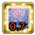
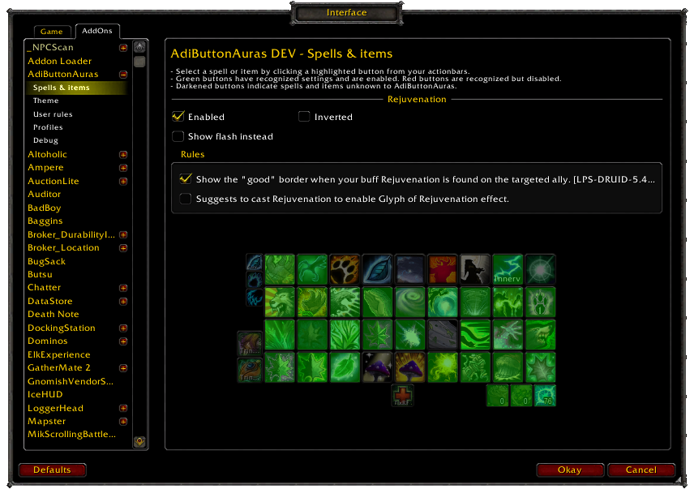

Introduction
============

AdiButtonAuras allows you to track buffs and debuffs (also known as "auras") by overlaying the relevant information on top of your actionbar buttons, like this:

What does it all mean?
======================

As a general rule:

  * Red border (known as "bad" highlight) means a dot on your target with the text showing the dot's duration 
  * Green border (known as "good" highlight) means a beneficial effect on yourself or a friendly target with the number meaning duration  or number of stacks . If the spell has both, duration will be on the left while stacks will be on the right .

**However, there are special cases!**

*Crowd control* abilities display the duration of all debuffs within the same diminishing returns category.

Some spells like Warlocks' Havoc have custom rules, e.g. red when you target the enemy affected by Havoc (to remember *not* to attack that target) and green when you target any other enemy.

Other classes have custom rules as well.

**AdiButtonAuras will also show special events.**

By making your buttons sparkle, much like the default UI does, only better!

  * It will make interrupt spells sparkle and display how long you have to interrupt 
  * It will show a hint when to use certain abilities like Soul Reaper under 35% hp 
  * Inform you when there is a buff you can purge from an enemy 
  * Or show you there is a debuff that you can dispel and its duration 

Setting up
==========

AdiButtonAuras comes with pre-built rules so it is ready to go without additional messing around, but if there is an aura you do not like you can open the options using `/adibuttonauras` or `/aba` and change the aura settings for the recognized buttons, which will be highlighted in green.

(Note: in this screenshot the [Dominos](http://www.curse.com/addons/wow/dominos) actionbar addon is being used and put on top of the options)

**But some of my buttons don't show any aura information and aren't even green when the options are open!**

AdiButtonAuras needs to know about the spell before it puts an aura on its button and unfortunately there are still some abilities that need to be included. If you encounter one of them please get in touch on the [Github issue tracker](https://github.com/Adirelle/AdiButtonAuras/issues).

Other options
-------------

Additionally there are several display options: from how long a (de)buff duration has to be to show a timer to theme settings, which allow you to personalize the look of the text and the colors if you have trouble seeing the default ones:

Getting Involved
================

AdiButtonAuras can always use some help, so if you want to give a hand or just know more about the addon take a look at the [technical details](https://github.com/Adirelle/AdiButtonAuras/blob/master/doc/Rules.md) or check the [project on Github](https://github.com/Adirelle/AdiButtonAuras).
